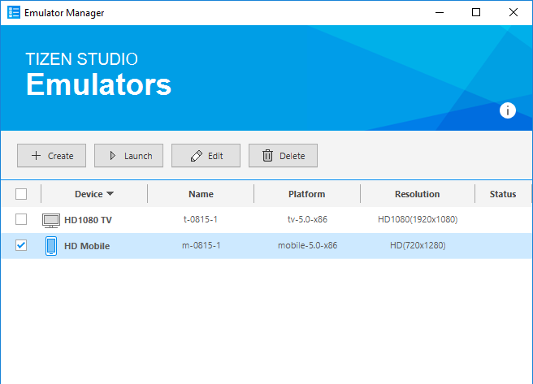
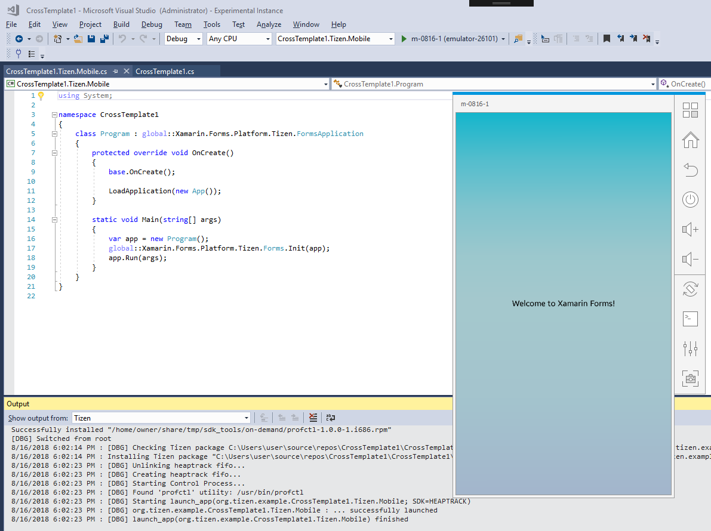
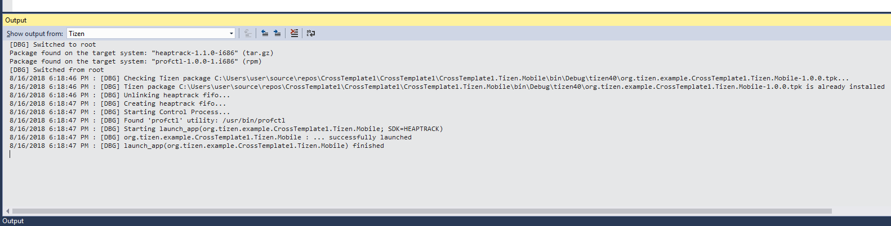

# Tizen .NET Memory Profiler for Microsoft Visual Studio

## Introduction

Tizen .NET Memory Profiler is based on an open-source memory profiler for C/C++ Linux applications named "Heaptrack". Heaptrack was created by Milian Wolff (see <http://milianw.de/tag/heaptrack> and <https://github.com/KDE/heaptrack>). Original Heaptrack's README can be found [here](docs/HEAPTRACK_README.md).

Later Samsung developers modified Heaptrack to support Samsung Tizen OS to enable profiling the memory consumption of managed .NET CoreCLR applications running under Tizen. The official name for this modification of heaptrack is Tizen .NET Memory Profiler. This tool can run under Linux only.
Original README for Tizen .NET Memory Profiler can be found [here](docs/TIZEN_HEAPTRACK_ORIGINAL_README.md).

The next step in evolution of Tizen .NET memory profiler is, porting its GUI to Windows platform and then integration into Visual Studio Tools for Tizen extension.

The same as original heaptrack, Tizen .NET Memory Profiler consists of the following two major parts:
 - a utility which collects memory profiling data and saves them to a file, this part of the Memory Profiler runs on the target side;

 - tools for analyzing the resulting data, the command-line one and the GUI-based one (originally named "heaptrack_gui"), these analyzing tools run on the host side.

The Tizen .NET Memory Profiler GUI provides different views on the collected data: text-based views (a summary, different lists and tables) and graphical ones (a so-called flame graph, several charts, and an allocation histogram).

Currently Tizen .NET Memory profiler is adapted for usage with Visual Studio Tools for Tizen extension.

Further in this document the Tizen .NET Memory profiler for MS Visual Studio is described in more details.

## Prerequisites

### Prerequisites for building

Linux and Windows hosts will be needed in order to build all components of the Memory Profiler.

#### Windows host
To build the Memory profiler GUI, any Microsoft Windows 64-bit operating system starting from Windows 7 can be used.

Additional software products and components must be installed on the Windows host. Please see [here](WINDOWS_GUI_BUILD.md) for the list of required additional software and instructions about how to obtain and install it.

#### Linux host
All build procedures were tested on the [Ubuntu 16.04](http://releases.ubuntu.com/16.04/)

The GBS build system must be installed to the Linux system. For more info about GBS installation please refer [here](https://source.tizen.org/documentation/developer-guide/getting-started-guide/installing-development-tools)


### Prerequisites for running
- VS Tools for Tizen. A compartible version of VS Tools for Tizen must be used which has the user interface for launching the Memory profiler.
- dotnet-launcher. A compartible version of dotnet-launcher must be used which has support for profiler launching.


## Build

The Tizen .NET Memory Profiler for Visual Studio consists of two components:
1) target-specific part (running on target side);
2) GUI (running on host side)


### Building target-specific part
The target specific part is built on Linux host  with GBS built system installed.

You should use compatible GBS config files to build the target-specific part for supported targets.

By default GBS store resulted RPMs and SRPMs at
`~/GBS-ROOT/local/repos/<distro>/<arch>` directories.

In the following examples option `-c` is used to specify path to the GBS config file and `-P` option to select profile suitable for target.

#### Build for ARM Tizen TM1 target

```console
~/heaptrack$ gbs -c ../gbs-config/gbs.conf build -P profile.arm.snapshot -A armv7l
```

#### Build for x86 Tizen emulator

```console
~/heaptrack$ gbs -c ../gbs-config/gbs.conf build -P profile.emul32.snapshot -A i586
```

### Building GUI

The Memory profiler GUI is built on Windows, detailed instructions are provided [here](WINDOWS_GUI_BUILD.md).

## Install procedure

### Installing target-specific part

After successfull build on the Linux host, resulting target-specific RPMs will be located in the corresponding directories

 `~/GBS-ROOT/local/repos/<distro>/<arch>/RPMS`

The resulting RPMs shall be copied to the Windows host into the following specific directory:

`<Tizen SDK installation dir>\platforms\tizen-4.0\common\on-demand`

The RPMs will be auhomatically installed by on demand installation procedure.

Alternatively manual installation procedure can be also used:
```
> sdb push RPMS /tmp
> sdb root on
> sdb shell
sh-3.2# export TERM=windows
sh-3.2#  cd /tmp
sh-3.2# mount -o rw,remount /
sh-3.2# rpm --force -i <rpm_packet_name>.rpm
```

### Installing GUI
After successfull build on the Windows host, a number of .dll and .exe files will be available in the build destination directory (see [here](WINDOWS_GUI_BUILD.md) for details).

These files shall be copied to the following directory:
`<Tizen SDK installation dir>\tools\memory-profiler`

## Running
Basic instructions for Running the Memory Profiler under  Visual Studio are provided below. For more detailed guide on the Memory profiler please refer to the [Original README](docs/TIZEN_HEAPTRACK_ORIGINAL_README.md)

### Step 1. Running Memory Profiler
   * In the menu, choose Tools > Tizen > Profiler > Run Memory Profiler.

     


   * If no Tizen device is connected and no Tizen emulators are running then Emulator Manager will be started. Please launch the type of emulator you want to use for running and profiling your application.

     


   * If everything is OK then the application starts as if you run it normally (using Start Debugging in Visual Studio).

     


   * In case of errors the Output Window will display them (the output below corresponds to the normal operation case).

     


   * After finishing the application the memory profiling data file will be copied from Tizen to Windows host.

### Step 2. Running Memory Profiler GUI
   * You can open the memory profiling data file in the GUI application to analyze it. In the menu, choose Tools > Tizen > Profiler > Show Memory Profiler.

     

### Step 3. Analyzing the results
   * The GUI application provides several views to the memory profiling data. The views include:

       - summary page with information on which process was profiled, its total runtime, some memory related statistics, etc.
       - bottom-up table tree view of the code locations that allocated memory with their aggregated cost and stack traces
       - caller/callee table
       - top-down table tree view of the code locations
       - managed heap table tree view
       - flame graph visualization (explanation: <http://www.brendangregg.com/FlameGraphs/memoryflamegraphs.html>)
       - consumed memory size over time graph
       - number of instances over time graph
       - number of memory allocations over time graph
       - size of memory allocated over time graph
       - allocation histogram displaying the number of allocations (the total number and the several topmost code locations) belonging to one of the groups divided by allocation size (0 - 8 bytes, 9 - 16 bytes, ... , 512 bytes - 1 KB, more than 1 KB)

#### Managed heap view sample

   

#### Flame graph view sample

   

#### Memory allocations graph view sample

   

#### Allocation histogram view sample

   
