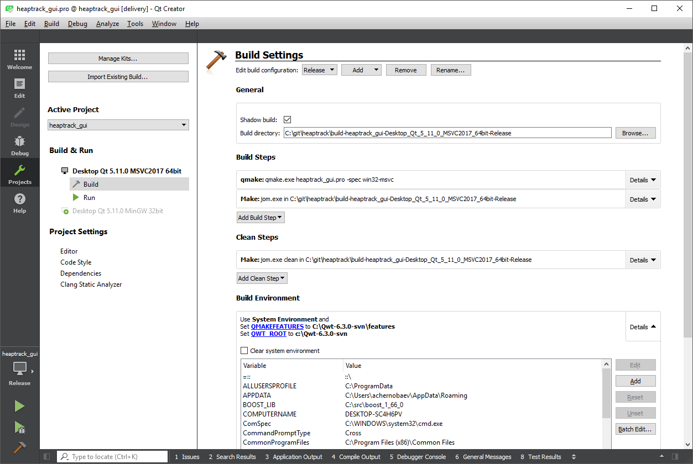
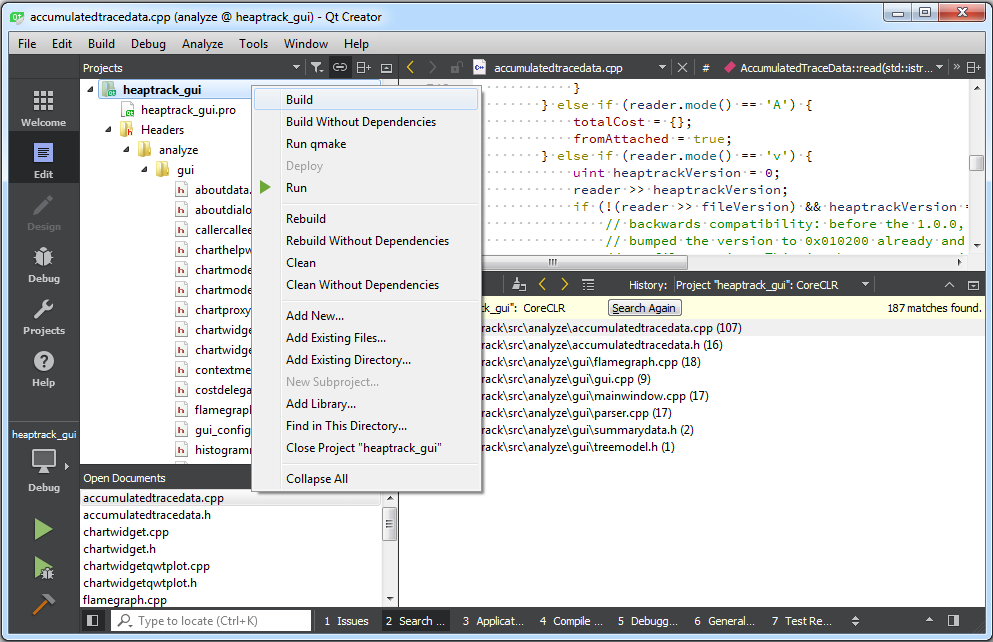

# Building Tizen .NET Memory Profiler GUI on Windows

## Introduction

Tizen .NET Memory Profiler is based on an open-source memory profiler for C/C++ Linux applications named "Heaptrack".

Tizen .NET Memory Profiler allows to profile the memory consumption of managed .NET CoreCLR applications running under Tizen OS.

The Memory profiler consists of the following two major parts:
 - a utility which collects memory profiling data and saves them to a file, this part of the Profiler runs on the target side;
 - tools for analyzing the resulting data, the command-line one and the GUI-based one (originally named "heaptrack_gui"), these analyzing tools run on the host side.

This document provides instructions on how to build the GUI-based part of the Memory profiler for Windows OS.

### Background regarding Windows GUI port
The original GUI application uses Qt framework. Qt is multi-platform supporting Windows but also the application uses several libraries from KDE Frameworks 5 (KF5): KCoreAddons, KI18n, ThreadWeaver, KChart, and others. The KDE Frameworks libraries are interrelated with Qt (they can be treated as a Qt superset). There is an ongoing project to port KDE applications and KDE Frameworks libraries to Windows (<https://community.kde.org/Windows>) but it’s not completed. Another issue is licensing: some KF5 libraries use GNU GPL v.2 license which is not acceptable according to Samsung (while LGPL is acceptable). It was easy to find replacements to most KDE libraries features used among Qt 5 libraries (Qt version 5.10 or later is recommended). The most important KDE library in question was KChart, a part of KDE KDiagram libraries. KChart is used in the original Heaptrack GUI application to draw charts and an allocation histogram.

Instead of KDE-specific libraries, the Windows GUI port uses QWT library (<http://qwt.sourceforge.net>) to draw charts on Windows platform. The library is licensed on terms of its own license based on LGPL (but less restrictive). It’s possible to use QWT instead of KChart when building the application on Linux as well (controlled by a setting in the application’s project file for *Qt Creator* / *qmake*).

## Prerequisites

Operating system: any Microsoft Windows 64-bit operating system starting from Windows 7 can be used to build the memory profiler GUI.

All needed prerequisites can be freely downloaded from Web. The following software and libraries are needed:

1. Microsoft Visual Studio 2017;

2. boost C++ libraries;

3. Qt 5 framework including some libraries, tools (*qmake*), and optionally IDE (*Qt Creator*);

4. QWT library and any SVN client to get it from its repository;

5. ThreadWeaver library and *git* software to get it from its repository.

### Microsoft Visual Studio 2017

Microsoft Visual Studio 2017 (<https://www.visualstudio.com/downloads>) or higher is required (Community Edition can be used). “Desktop development with C++” workload must be selected in Visual Studio installer as well as the “VC++ 2017 v141 toolset (x86, x64)” and “MSBuild” components (see Individual components | Compilers, build tools, and runtimes).

### Boost libraries

Boost library 1.66.0 or higher can be downloaded from <https://www.boost.org>. Build instructions:

1. extract files e.g. to *c:\src\boost_1_66_0*;

2. open “x64 Native Tools Command Prompt for VS 2017” available in Windows Start Menu under Visual Studio 2017 submenu;

3. build Boost.Build engine: go to *c:\src\boost_1_66_0* and start *bootstrap.bat*.

Special handling is required to build the required boost library *iostreams* with *zlib* support enabled. Original *zlib* library sources are needed for that.

4. download *zlib* sources from <http://zlib.net> (direct link to version 1.2.11 is <http://zlib.net/zlib-1.2.11.tar.gz>) and extract them to some directory, for example *c:\src\zlib-1.2.11*;

5. run *b2.exe* built on step 3 with the following options: 
`b2 -a --with-iostreams -sZLIB_SOURCE="c:/src/zlib-1.2.11"`

Finally create the system environment variable BOOST_LIB and set it to *c:\src\boost_1_66_0* (you may use *System Properties \ Advanced \ Environment Variables* Windows dialog for this).

### Qt 5

Download open source Qt from <https://www.qt.io/download>. The software can be installed with the help of Qt Online Installer for Windows. It’s necessary to select the “MSVC 2017 64-bit” component (Qt 5.xx Prebuilt Components for MSVC 2017 64-bit) in the installer’s component tree (under “Qt \ Qt 5.xx”). To enable building the memory profiler from IDE (*Qt Creator*) and debugging it with the help of CDB (Microsoft Symbolic Debugger for Windows) the “Qt Creator 4.xx CDB Debugger Support” shall be selected (*Qt Creator* itself is always selected). CDB is a part of Windows SDK (WDK) which can be installed using Windows SDK online installer (for Windows 10 it’s available from <https://developer.microsoft.com/en-us/windows/downloads/windows-10-sdk>): select *Debugging Tools for Windows* feature.

### QWT

QWT 6.2 or higher is needed for the memory profiler GUI. Its sources can be received using this command (presuming “svn” utility is installed):

`svn checkout https://svn.code.sf.net/p/qwt/code/trunk`

If the current directory was *c:\svn* then after running the command the latest QWT sources will be located at *c:\svn\trunk\qwt\src*.

QWT documentation suggests downloading stable releases from <https://sourceforge.net/projects/qwt/files/qwt> but it seems the versions available there are rather obsolete.

Building:

1. open *Qt command prompt* (e.g. “Qt 5.11.0 64-bit for Desktop (MSVC 2017)”) available in Windows Start Menu under Qt submenu;

2. go to the directory where *qwt.pro* file is located, e.g. 
`cd c:\svn\trunk\qwt`

3. (optionally) edit *qwtconfig.pri*, e.g. set the QWT_INSTALL_PREFIX variable (see *win32* section in the file) to the directory you want (the default is *C:/Qwt-$$QWT_VERSION-svn*);

4. setup the 64-bit MSVC compiler environment running *vcvars64.bat* script: if Visual Studio 2017 is installed to “c:\Program Files (x86)” then run 
`“c:\Program Files (x86)\Microsoft Visual Studio 14.0\VC\bin\amd64\vcvars64.bat”`

5. ensure “rc.exe” for x64 platform is in the path; it’s location depends on the version of Windows Kits installed, e.g. it can be located in “c:\Program Files (x86)\Windows Kits\10\bin\10.0.16299.0\x64” – you may add this folder to PATH temporarily: 
`set PATH=%PATH%;"C:\Program Files (x86)\Windows Kits\10\bin\10.0.16299.0\x64"`

6. run `qmake qwt.pro`, then `nmake`, then `nmake install`.

After successful completion of these steps QWT files including headers, documentation, and binaries will be located under *C:\Qwt-$$QWT_VERSION-svn* folder (e.g. *C:\Qwt-6.3.0-svn*). Dynamic link libraries needed to run the memory profiler GUI, *qwt.dll* and *qwtd.dll* (for Debug version), are in *lib* subfolder of that folder.

### ThreadWeaver

This library is a helper for multithreaded programming. It is used in the memory profiler GUI to speed-up some operations, such as parsing the source memory profiling data, on multi-CPU and multicore systems. It can be built from sources available from its repository:

`git clone git://anongit.kde.org/threadweaver.git`

The recommended path to clone to is *c:\git\kf5\threadweaver*. In this case the *qmake* project file for ThreadWeaver added to *heaptrack* to build the library may be used “as is”. If *heaptrack* (with Tizen Memory Profiler GUI) repository is located in “c:\git\heaptrack” then the project file is “C:\git\heaptrack\src\ThreadWeaver.pro”. You may load it to *Qt Creator* and then build or use *qmake* utility from *Qt command prompt* (the 64-bit MSVC compiler environment must be set – see above).

Build DEBUG version:

`qmake.exe ThreadWeaver.pro -spec win32-msvc "CONFIG+=debug" "CONFIG+=qml_debug"` 
`nmake`

Build RELEASE version:

`qmake.exe ThreadWeaver.pro -spec win32-msvc` 
`nmake`

## Building the GUI application

### How to build

After building all libraries required it’s possible to build the GUI application itself. It can be done using *Qt Creator* or *qmake* utility. The application's project file in *qmake* format is *heaptrack_gui.pro*. In either case two environment variables must be set (on the system level or in *Qt Creator*, in the *heaptrack_gui* project settings – both for Debug and Release build configurations) to be able to use QWT. First variable, QMAKEFEATURES, must point to the QWT “features” folder (where *prf-* and *pri-* files are located), e.g. 
`QMAKEFEATURES=c:\Qwt-6.3.0-svn\features`.

Another variable, QWT_ROOT, must point to the base QWT folder, e.g. 
`QWT_ROOT=c:\Qwt-6.3.0-svn`.

For setting the variables in *Qt Creator* you need to switch to the *Projects* mode in *Mode Selector* (use *Window* | *Show Mode Selector* menu command to show the selector if it's not visible). Then ensure that *Active Project* is *heaptrack_gui* and *Build* is selected in the *Build & Run* section (see the left part of the window) under the name of the Qt Kit used (e.g. "Desktop Qt 5.11.0 MSVC2017 64bit"). In the *Build Settings* section (the right part of the window) you need to edit *Build Environment*: press *Details* button in the *Build Environment* section to expand the section and then use *Add* or *Batch Edit* button to set the variables. Do this for Debug and Release build configurations (change the configuration using the *Edit build configuration* combo box located at the top of *Build Settings*).

Then you may load *heaptrack\src\heaptrack_gui.pro*, select the required build configuration (Debug or Release) and start the build from the project's context menu (*heaptrack_gui* project shall be selected in the Projects tree) or from the "Build" top-level menu of the main menu bar.

If using *qmake* you can start *Qt command prompt*, go to the *heaptrack\src* path and run 
`qmake heaptrack_gui.pro -spec win32-msvc`.

After that the application shall build successfully. To be able to run it from *Qt Creator* the dynamic library *qwtd.dll* (*qwt.dll* for Release version) must be copied from the QWT output directory (e.g. *c:\Qwt-6.3.0-svn\lib*) to *bin\debug* (*bin\release*) folders.

### Application's binaries

The following files and directories are required to run the application (Release version) under Windows.

<pre>
TizenMemoryProfiler.exe
Qt5Core.dll
Qt5Gui.dll
Qt5OpenGL.dll
Qt5Svg.dll
Qt5Widgets.dll
qwt.dll
threadweaver.dll
<b>imageformats\</b>qjpeg.dll
<b>platforms\</b>qwindows.dll
<b>styles\</b>qwindowsvistastyle.dll
</pre>

After building the Release configuration of the GUI application (TizenMemoryProfiler.exe) using *Qt Creator* or *qmake* the required dynamic link libraries (except *threadweaver.dll*) will be copied to the destination directory *bin\release* automatically. The remaining *threadweaver.dll* file will be created after building *ThreadWeaver.pro* if the library was installed to the recommended directory (see [ThreadWeaver](#ThreadWeaver)), otherwise you may need to copy this file manually.

You may also use the Qt Windows deployment tool *windeployqt* (see [Qt for Windows - Deployment](http://doc.qt.io/qt-5/windows-deployment.html)) to create a folder containing the Qt-related dependencies of TizenMemoryProfiler.exe (but some of the files and directories copied by the tool may be unnecessary). File *qwt.dll* (and possibly *threadweaver.dll*) shall be copied manually in this case.
